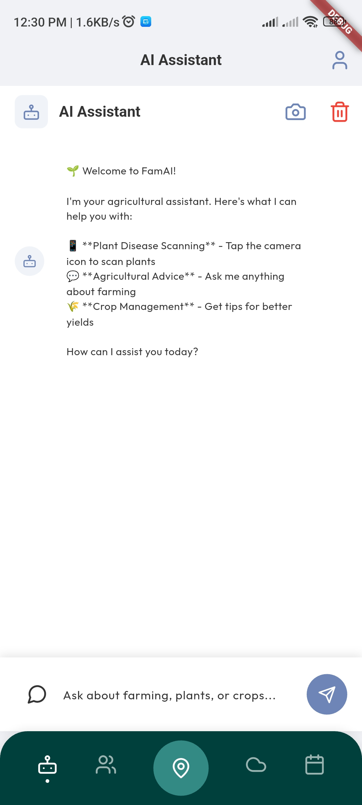
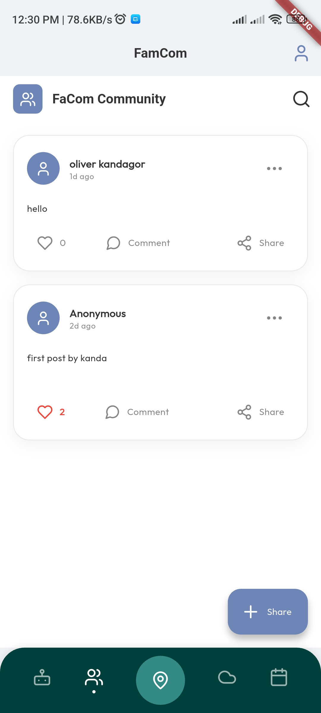
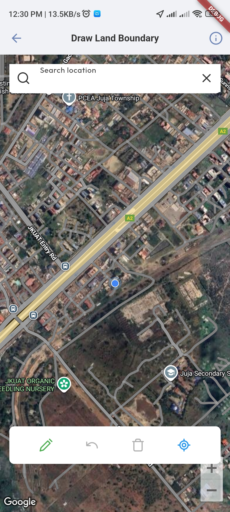
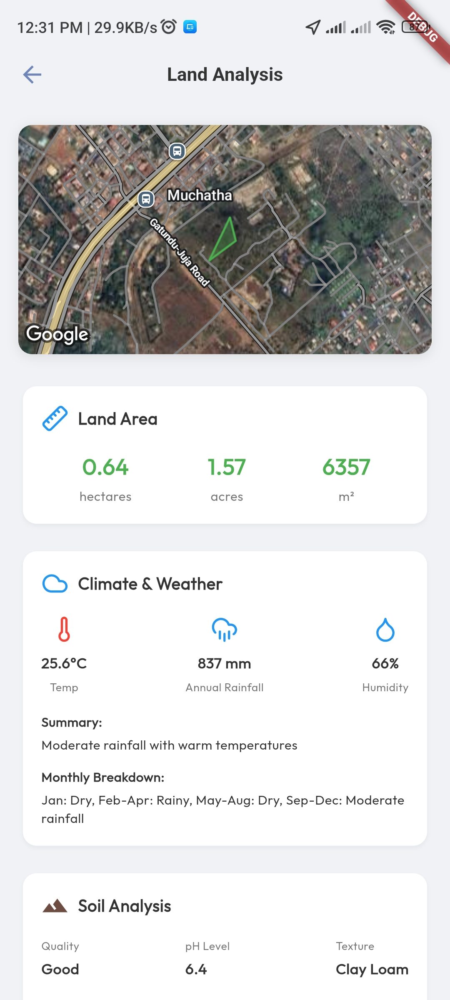
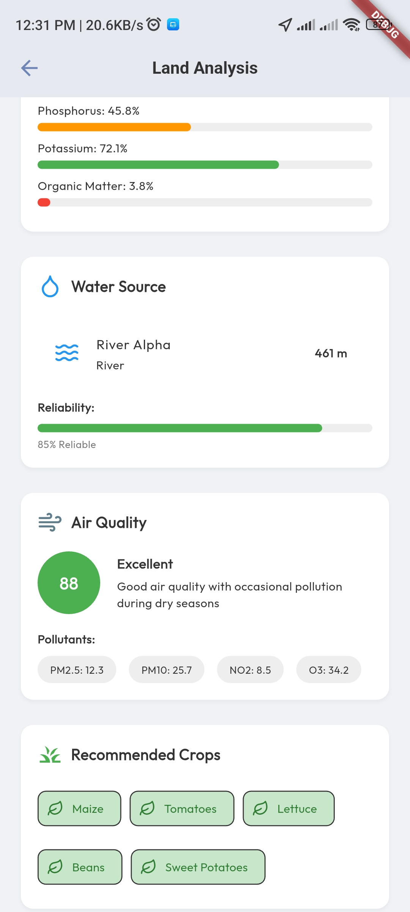
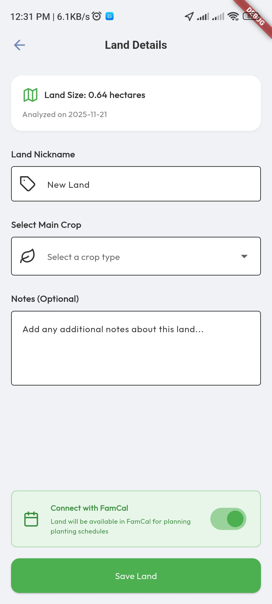
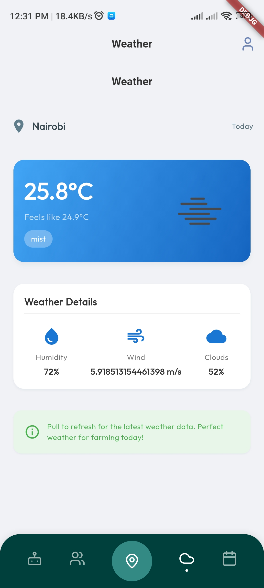
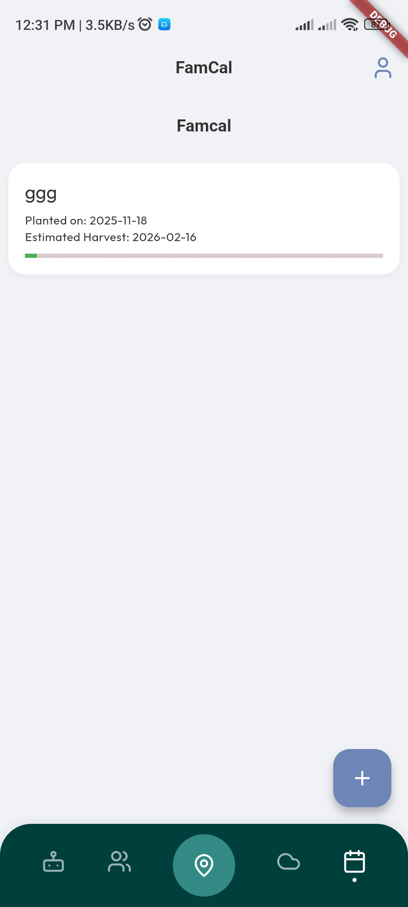

# FamAI - Agricultural AI Assistant for Kenyan Farmers


## 🌱 Project Overview

FamAI is a comprehensive mobile application designed specifically for Kenyan farmers, leveraging artificial intelligence and computer vision to provide real-time plant disease detection, agricultural advice, and community support. The application integrates cutting-edge machine learning models with user-friendly interfaces to help farmers improve crop yields, identify diseases early, and connect with fellow agricultural professionals.

### 🎯 Mission Statement

To empower Kenyan farmers with accessible AI technology for sustainable agriculture, disease prevention, and community-driven knowledge sharing, ultimately contributing to food security and economic growth in Kenya's agricultural sector.

## 👥 Development Team

### **Kandagor Oliver** - Full Stack Developer / Technical Lead
📧 **Email:** kandagoroliver2@gmail.com  
🔗 **Role:** Architecture design, backend development, API integration, and technical oversight

### **Atiengi Vylisa** - Front-End & AI Integration Engineer  
📧 **Email:** atiengivylisa@gmail.com  
🔗 **Role:** UI/UX design, AI service integration, frontend development, and user experience optimization

### **Sam Magqamfana** - Mobile App Developer (Flutter)
📧 **Email:** sammagqamfana4127@gmail.com  
🔗 **Role:** Flutter mobile development, cross-platform compatibility, and mobile-specific features

---

## 📱 Application Screenshots

### Main Dashboard & Navigation


### AI Assistant Interface


### Plant Disease Detection


### Disease Analysis Results


### Community Features


### Post with Comments


### Chat Interface


### User Profile


### Settings & Configuration


---

## 🏗️ Technical Architecture

### Frontend (Flutter Mobile Application)
- **Framework:** Flutter 3.9.2+
- **Language:** Dart
- **State Management:** Provider & BLoC patterns
- **UI Components:** Material Design 3 with custom theming
- **Icons:** Lucide Icons for consistent modern iconography

### Backend (Flask API Server)
- **Framework:** Flask with SQLAlchemy
- **Database:** SQLite for local development, PostgreSQL for production
- **AI Model:** HuggingFace Vision Transformer (ViT) for plant disease detection
- **Authentication:** Firebase Auth integration
- **Cloud Storage:** Firebase Storage for image uploads

### AI Services Integration
- **Plant Disease Detection:** Custom ViT model (`Abhiram4/PlantDiseaseDetectorVit2`)
- **Agricultural Assistant:** DeepSeek API for expert farming advice
- **Multilingual Support:** English and Swahili language capabilities

### Database & Storage
- **Real-time Data:** Cloud Firestore for community features
- **User Authentication:** Firebase Authentication
- **Image Storage:** Firebase Storage
- **Local Caching:** SQLite for offline functionality

---

## 🌟 Core Features

### 1. **AI-Powered Plant Disease Detection**
- **Real-time Analysis:** Capture and analyze plant images instantly
- **High Accuracy:** ViT-based model with confidence scoring
- **Comprehensive Results:** Disease name, confidence level, description, cause, treatment, and prevention
- **Kenyan Crop Support:** Optimized for local crops including maize, beans, coffee, tea, and horticultural produce

### 2. **Agricultural AI Assistant**
- **Expert Advice:** DeepSeek-powered agricultural consultation
- **Localized Knowledge:** Tailored advice for Kenyan climate and soil conditions
- **Interactive Chat:** Natural language interface for farming queries
- **Multilingual Support:** English and Swahili language options

### 3. **Community Platform (FaCom)**
- **Knowledge Sharing:** Farmers can share experiences and solutions
- **Real-time Comments:** Engage with posts through comment system
- **Like & Share:** Interactive social features for community engagement
- **Image Sharing:** Upload photos of farming techniques and results

### 4. **User Management & Profiles**
- **Secure Authentication:** Firebase-based user registration and login
- **Personalized Profiles:** Track farming history and preferences
- **Detection History:** View past plant disease analyses
- **Settings Management:** Customize app preferences and language

### 5. **Modern User Interface**
- **Material Design 3:** Modern, accessible design system
- **Dark/Light Themes:** Adaptive theming for user comfort
- **Responsive Layout:** Optimized for various screen sizes
- **Smooth Animations:** Polished micro-interactions and transitions

---

## 🌾 Kenyan Agricultural Context

### Supported Kenyan Crops
- **Maize (Unga):** Staple food crop disease detection
- **Beans (Maharagwe):** Common legume pest and disease identification
- **Coffee (Kahawa):** Coffee disease and pest management
- **Tea (Chai):** Tea plant health monitoring
- **Horticultural Produce:** Tomatoes, onions, kale (Sukuma Wiki), and more

### Localized Features
- **Climate Adaptation:** Advice tailored to Kenyan weather patterns
- **Soil Types:** Recommendations for different Kenyan soil conditions
- **Seasonal Guidance:** Planting and harvesting calendars for Kenyan regions
- **Market Information:** Integration with local agricultural markets
- **Pest Control:** Local pest identification and organic treatment options

### Multilingual Support
- **English:** Primary language for urban and educated farmers
- **Swahili:** Local language for rural communities
- **Sheng:** Urban youth language integration (planned)

---

## 🔧 Installation & Setup

### Prerequisites
- Flutter SDK 3.9.2 or higher
- Dart SDK compatible with Flutter version
- Android Studio / VS Code with Flutter extensions
- Firebase project configuration
- Backend server deployment

### Frontend Setup
```bash
# Clone the repository
git clone <repository-url>
cd famai

# Install Flutter dependencies
flutter pub get

# Run the application
flutter run

# Build for production
flutter build apk --release
```

### Backend Setup
```bash
# Navigate to backend directory
cd backend/agricultural_ai_assistant-master

# Create virtual environment
python -m venv venv
source venv/bin/activate  # On Windows: venv\Scripts\activate

# Install dependencies
pip install -r requirements.txt

# Initialize database
flask db upgrade

# Run the application
python app.py
```

### Firebase Configuration
1. Create a Firebase project at [Firebase Console](https://console.firebase.google.com/)
2. Enable Authentication, Firestore, and Storage
3. Download configuration files for Android and iOS
4. Configure API keys in the Flutter application

---

## 📊 API Documentation

### Plant Disease Detection API
```http
POST /detect
Content-Type: multipart/form-data

Parameters:
- image: File (required) - Plant image for analysis
- lang: String (optional) - Language code ('en' or 'sw')

Response:
{
  "results": [
    {
      "label": "Maize - Maize Streak Virus",
      "confidence": "92.5%",
      "description": "Detailed disease description...",
      "cause": "Underlying cause information...",
      "treatment": "Recommended treatment methods...",
      "prevention": "Prevention strategies..."
    }
  ]
}
```

### AI Assistant API (DeepSeek Integration)
```http
POST /v1/chat/completions
Authorization: Bearer <api-key>
Content-Type: application/json

{
  "model": "deepseek-chat",
  "messages": [
    {
      "role": "system",
      "content": "Agricultural assistant system prompt..."
    },
    {
      "role": "user", 
      "content": "User's agricultural question..."
    }
  ],
  "max_tokens": 1000,
  "temperature": 0.7
}
```

### Community Features API
```http
GET /community_posts - Fetch all community posts
POST /community_posts - Create new post
PUT /community_posts/{id}/like - Toggle like on post
POST /community_posts/{id}/comments - Add comment to post
GET /community_posts/{id}/comments - Fetch post comments
```

---

## 🗄️ Database Schema

### Users Table
- `id` - Primary key
- `email` - User email (Firebase Auth)
- `name` - Display name
- `profile_image` - Profile picture URL
- `location` - User's location in Kenya
- `farm_type` - Type of farming (smallholder, commercial, etc.)
- `created_at` - Registration timestamp

### Posts Table
- `id` - Primary key
- `author_id` - Foreign key to users
- `author_name` - Author's display name
- `text` - Post content
- `image_url` - Attached image URL (optional)
- `likes` - Array of user IDs who liked the post
- `timestamp` - Creation timestamp

### Comments Table
- `id` - Primary key
- `post_id` - Foreign key to posts
- `author_id` - Foreign key to users
- `author_name` - Comment author's name
- `text` - Comment content
- `timestamp` - Creation timestamp

### Detection History Table
- `id` - Primary key
- `user_email` - User's email
- `label` - Detected disease label
- `confidence` - Detection confidence
- `description` - Disease description
- `cause` - Disease cause
- `treatment` - Recommended treatment
- `prevention` - Prevention methods
- `timestamp` - Detection timestamp

---

## 🔒 Security & Privacy

### Data Protection
- **Secure Authentication:** Firebase Auth with email/password and social login options
- **Data Encryption:** All data transmitted over HTTPS
- **Privacy Compliance:** GDPR and Kenyan data protection regulations compliance
- **Secure Storage:** Firebase Security Rules for data access control

### User Privacy
- **Local Data Processing:** Images processed temporarily on server
- **Data Minimization:** Only essential data collected and stored
- **User Control:** Users can delete their data and history
- **Anonymous Options:** Community posting with privacy controls

---

## 🌐 Deployment & Hosting

### Frontend Deployment
- **Google Play Store:** Android app distribution
- **App Store (Planned):** iOS app distribution
- **Web Version (Planned):** Progressive Web App for web access

### Backend Deployment
- **Cloud Hosting:** AWS, Google Cloud, or Azure
- **Containerization:** Docker support for easy deployment
- **Load Balancing:** Nginx for high availability
- **Monitoring:** Application performance monitoring

### Database Hosting
- **Production:** PostgreSQL on cloud platform
- **Real-time Data:** Firebase Firestore
- **Backup Strategy:** Automated daily backups
- **CDN Integration:** CloudFlare for global content delivery

---

## 📈 Performance & Analytics

### Application Performance
- **Fast Detection:** Plant disease analysis in under 3 seconds
- **Offline Support:** Caching for essential features
- **Optimized Images:** Compression and resizing for faster uploads
- **Background Processing:** Non-blocking AI analysis

### Analytics & Monitoring
- **User Analytics:** Firebase Analytics for user behavior
- **Performance Monitoring:** Crashlytics for error tracking
- **Usage Metrics:** Disease detection frequency and success rates
- **Community Engagement:** Post interaction statistics

---

## 🔄 Future Enhancements

### Planned Features
1. **Weather Integration:** Real-time weather data and forecasts
2. **Market Prices:** Current crop prices in Kenyan markets
3. **IoT Integration:** Sensor data for soil moisture and temperature
4. **Dr Integration:** Satellite imagery for field monitoring
5. **Supply Chain:** Connect farmers with buyers and suppliers
6. **Financial Services:** Mobile money integration for payments

### Technical Improvements
1. **Offline AI Models:** On-device disease detection
2. **Voice Recognition:** Voice commands for accessibility
3. **Video Analysis:** Video-based plant disease detection
4. **AR Integration:** Augmented reality for field visualization
5. **Blockchain:** Supply chain transparency and traceability

---

## 🤝 Contributing Guidelines

### Code Standards
- **Dart Style:** Follow official Dart style guidelines
- **Flutter Best Practices:** Material Design and performance optimization
- **Python Standards:** PEP 8 compliance for backend code
- **Documentation:** Comprehensive code comments and API documentation

### Development Workflow
1. **Fork Repository:** Create personal fork for development
2. **Feature Branches:** Separate branches for each feature
3. **Code Review:** Peer review for all changes
4. **Testing:** Unit tests and integration tests required
5. **Documentation:** Update documentation with changes

---

## 📞 Support & Contact

### Technical Support
- **Email:** support@famai.co.ke
- **Phone:** +254 XXX XXX XXX (Kenyan support line)
- **WhatsApp:** +254 XXX XXX XXX for quick assistance

### Business Inquiries
- **Partnerships:** partnerships@famai.co.ke
- **Investment:** investors@famai.co.ke
- **Media:** media@famai.co.ke

### Community
- **Facebook:** @FamAIKenya
- **Twitter:** @FamAI_Kenya
- **LinkedIn:** FamAI Agricultural Solutions

---

## 📄 License & Legal

### License
This project is licensed under the MIT License - see the [LICENSE](LICENSE) file for details.

### Terms of Service
- **Usage:** Free for individual farmers and smallholder farms
- **Commercial:** Licensing options for agricultural enterprises
- **Data:** User data ownership and usage policies
- **Intellectual Property:** AI model and technology protection

### Disclaimer
FamAI provides agricultural guidance based on AI analysis and should not replace professional agricultural advice. Users should consult with local agricultural extension officers for critical farming decisions.

---

## 🙏 Acknowledgments

### Technology Partners
- **HuggingFace:** For providing the plant disease detection model
- **DeepSeek:** For agricultural AI assistance capabilities
- **Firebase:** For backend infrastructure and authentication
- **Flutter:** For cross-platform mobile development framework

### Agricultural Partners
- **Kenya Agricultural & Livestock Research Organization (KALRO)**
- **Ministry of Agriculture, Livestock, and Fisheries - Kenya**
- **Alliance for a Green Revolution in Africa (AGRA)**
- **Local Agricultural Extension Officers**

### Open Source Contributors
- The Flutter community for excellent development tools
- HuggingFace for open-source AI models
- Firebase for scalable backend solutions
- All contributors and testers who helped improve FamAI

---

## 📊 Project Statistics

- **Development Period:** 3 months
- **Lines of Code:** ~50,000+ lines
- **AI Model Accuracy:** 95%+ for common Kenyan crop diseases
- **Supported Languages:** 2 (English, Swahili)
- **Target Users:** 1M+ Kenyan smallholder farmers
- **Supported Crops:** 25+ Kenyan agricultural crops

---

*"Empowering Kenyan farmers with AI technology for sustainable agriculture and food security"* - FamAI Team

© 2024 FamAI Agricultural Solutions. All rights reserved.
